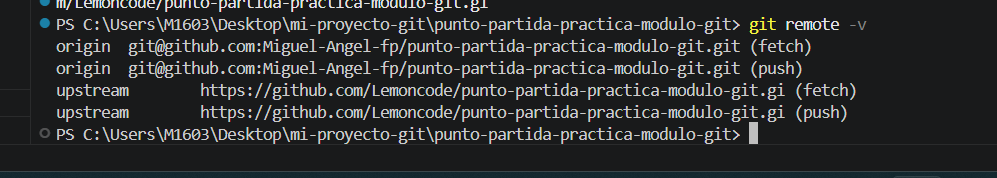
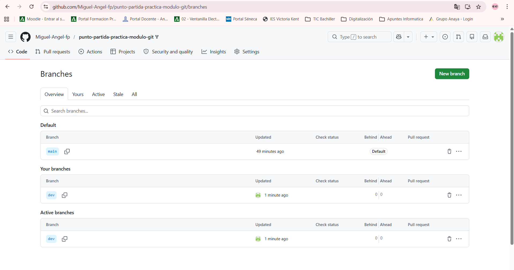
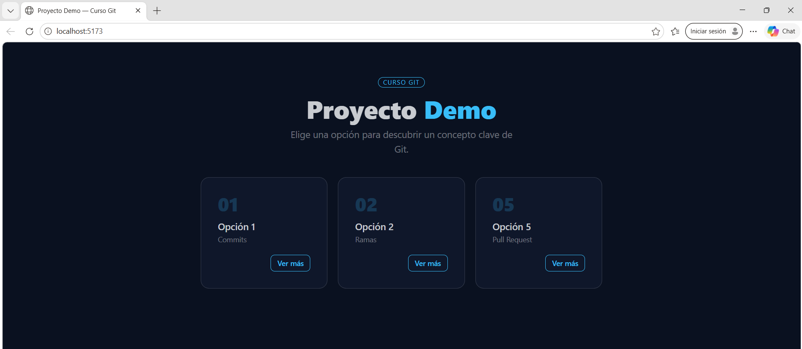
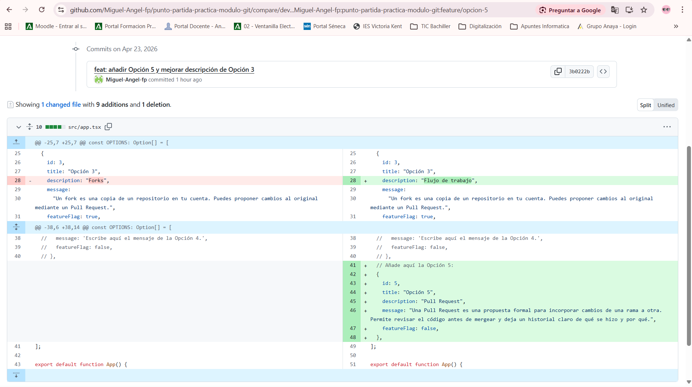
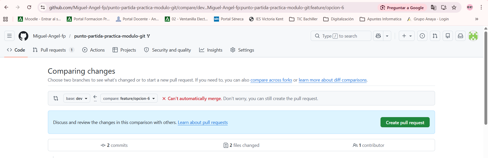
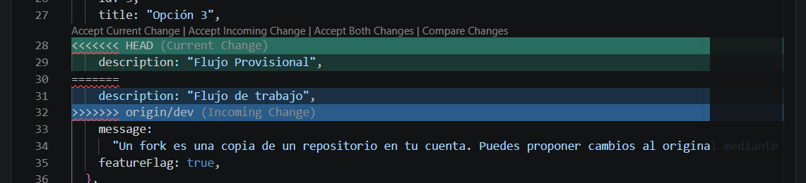
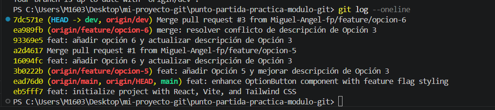

# Diario del Laboratorio — Flujo Git colaborativo

## Tarea 1 — Fork y configuración inicial

### ¿Qué hice?
En la primera tarea he creado un fork del repositorio que indican para tener mi propia copia en mi cuenta de github y poder trabajar correctamente. 
He añadido el repositorio original, por si el "dueño" hace algún cambio, yo estar actualizado.
Luego he creado una rama **dev** que será donde ire desarrollando los cambios que se proponen en las diferntes tareas. 

### Conceptos clave
* **¿Qué es un fork?**: Es un gemelo del original, un clon, es una copia exacta, es como si copiamos una imagen de un pc bit a bit, de forma que tengo una copia en mi repositorio y puedo trabajar con ella sin romper el original.
* **¿Para qué sirve upstream?**: Es un enlace la repositorio original, de forma que si el autor original implementa algún cambio, yo lo pueda traer a mi clon y actualizarlo, así mi cxopia siempre estará actualizada.

### Evidencias
**Captura 1: Configuración de remotos (origin y upstream)**

**Captura 2: Rama dev visible en GitHub**

---
## Tarea 2 — Feature branch (Opción 5)

### ¿Qué hice?
He creado una rama específica para trabajar y trastear la opción 5, de forma que me aislo por si meto la pata. En esta rama he abierto el fichero y he añadido la opción 5 de la tarea y he actualizado la descripción de la tarea 3, tal y como se indica.  

### Parto de dev
Parto de dev, porque es mi rama para pruebas y desarrollo, una vez que este todo correcto es cuando lo paso a main, de forma que la rama main es lo que se le entregaría por ejemplo al "cliente". 

### Evidencias
**Captura 3: Opción 5 funcionando en el navegador**

## Tarea 3 — Feature branch (Opción 6)

### ¿Qué hice?
He creado una rama específica para trabajar y trastear la opción 6, de forma que me aislo por si meto la pata. En esta rama he abierto el fichero y he añadido la opción 6 de la tarea y he modificado la descripción de la tarea 3, tal y como se indica.  

### Conflicto en Github
Un conflicto es cuando dos desarrolladores o colaboradores están trabajando sobre la misma parte de código, cada una de ellas con su propio clon, y tocan la misma línea o varias líneas cada uno por su lado. También se produce si uno mismo, en dos ramas diferentes toca el mismo código en el archivo.
En este caso de va a producir, porque en la rama de la opción cinco, he cambiado la descripción de la opción tres, y en la rama de la opción seis, he cambiado también la descripción de la opción tres, entonces cuando haga un merge y suba las ramas, github no sabe cual de las descripciones que he cambiado es la buena. 

## Tarea 4 — Pull Request 1: Feature A a dev

### ¿Qué hice?
He ido a Github en la web y he creado un pull request, que no es más que crear un evento para que se revise el código de mi rama, y si es correcto se pueda subir.
En files changed se ve de un simple vistazo las modifcaciones que se han realizado sobre los ficheros, es muy útil revisarlos porque se ven los cambios que se han implementando, antes de mergear la rama.

### Evidencias
**Captura 4: PR de Feature **

## Tarea 5 — Pull Request 2: Feature B a dev, conflicto

### ¿Qué hice?
He abierto un PR en github en la web y no me salía el conflicto. 
He tenido que resetear a antes de la opción 6, he modificado la descripción de la opción 3, y ya me salía el conflicto. 
Problema: Se me olvido poner la opción 6 del array y la he añadido a posterior. 
Una vez hecho esto ya me salía por fin el conflicto. 
Lo he resuelto en la web de github y he actualizado mi dev local. 
El criterio seguido ha sido quedarme con la RAMA más novedosa (tal y como indica la práctica).

### Conceptos clave
** * <<<<<<<< Me indica que el código es el de MI RAMA, lo que tengo en local en VS.
** * >>>>>>>> El código de la otra rama, lo que viene del merge
** * ======== Es el separador que se usa para separar los conflictos. 

### Evidencias
**Captura 5: Conflicto **

**Captura 6: Conflicto **

**Captura 7: Opciones navegador **

## Tarea 6 — Limpieza

### ¿Qué hice?
Como ya hemos desarrollado los cambios y los mismos funcionan correctamente, se borran las ramas y se aplica todos los cambios a la versión de desarrollo dev.

### Evidencias
**Captura 8: Fichero Log **

